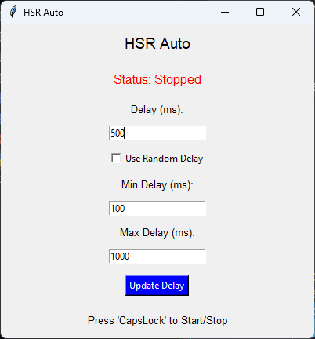

# HSR Auto Story

Auto clicker for Honkai: Star Rail because i'm too lazy to press space and choose a dialog

**Important:**

- sometimes HSR won't continue the dialog when you press space. In that case, you have to click the mouse manually to continue.
- run the program as an administrator.

### Features

- Set delay intervals or you can choose to random the intervals.
- Start/Stop with hotkey.

### How to use

- Set Delay: set a fixed delay or random delay.
- Update Delay: click "Update Delay" button whenever you make changes.
- Start/Stop: press `capslock` key to start/stop the program.
